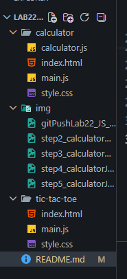

# Калькулятор

## 1. Описание проекта

Простой веб-калькулятор. Поддерживает базовые арифметические операции, имеет защиту от некорректного ввода и обрабатывает ошибки вычислений.

## 2. Функциональность

### Поддерживаемые операции
- Сложение
- Вычитание
- Умножение
- Деление
- Десятичные дроби
- Очистка поля

### Ограничения
- Не поддерживаются скобки
- Не поддерживаются отрицательные числа в начале выражения
- Нельзя вводить два оператора подряд
- Нельзя вводить несколько точек в одном числе
- Оператор не может быть последним символом

### Обработка ошибок
- Деление на ноль
- Некорректное выражение
- При ошибке калькулятор очищается и готов к новому вводу

## 3. Архитектура

### Структура файлов

### Класс Calculator
В нём хранятся:
- `display` — экран калькулятора
- `expression` — то, что ввёл пользователь
- `hasError` — была ли ошибка

И методы:
- `init()` — запускает калькулятор
- `handleButtonClick()` — обрабатывает нажатия
- `calculate()` — считает результат
- `clear()` — очищает
- `updateDisplay()` — обновляет экран

## 4. Логика работы

### Как работает
1. Нажимаю кнопку с цифрой
2. Цифра добавляется в выражение
3. Показывается на экране
4. При нажатии `=` вычисляется результат
5. Результат выводится на экран

### Валидация
Перед добавлением символа проверяю:
- Не идёт ли оператор после оператора
- Не начинается ли выражение с `*` или `/`
- Нет ли лишней точки в числе

### Вычисление
Перед вычислением проверяю выражение на правильность. Если всё ок — считаю. Если ошибка — вывожу сообщение.

## Запуск
Открываю `index.html` в Live режиме, всё работает.